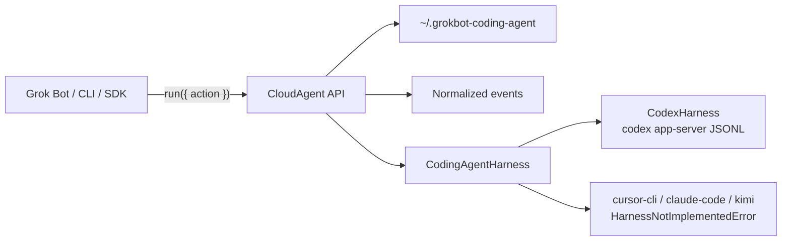

# @oana/grokbot-coding-agent

Product home is **this oanastack tree** (`packages/grokbot-coding-agent/`). Canonical invoke is **`oana grokc …`**. Do not clone, link, or maintain a separate grokc CLI repo. The standalone `grokc` / `grokbot-coding-agent` bins are optional aliases of `oana grokc`.

Agent 用法走 oanastack skill（入口 [`../../skills/oanastack/SKILL.md`](../../skills/oanastack/SKILL.md)；工具章 [`../../skills/oanastack/references/grokc.md`](../../skills/oanastack/references/grokc.md)）。

Harness-agnostic TypeScript SDK + CLI for first-class coding-agent sessions.

The **bot-facing surface** mirrors Cursor’s CloudAgent tool so Grok Bot can transfer skills 1:1 (`launch` / `reply` / `get` / `list` / `watch` / `dump` / `cancel` / `archive` / `unarchive` / `rename`). A Session/harness layer sits underneath; Codex is the first working runtime.

- Package: `@oana/grokbot-coding-agent`
- CLI: `oana grokc` (optional alias: `grokc` / `grokbot-coding-agent`)
- State dir: `~/.grokbot-coding-agent/`
- Worktrees: Worktrunk (`wt`). Override the binary with `WORKTRUNK_BIN`.
- First harness: local `codex app-server` (JSONL, no `jsonrpc` field on the wire)
- Approvals: **not** auto-accepted. Codex approval requests stay pending until `approve`.
- Stubs only: `cursor-cli`, `claude-code`, `kimi`

## Architecture



```
Clients → CloudAgent actions → events + local state + approvals → harness adapters → agent runtimes
```

## CloudAgent mapping

| CloudAgent | @oana/grokbot-coding-agent | Local semantics |
|---|---|---|
| `launch` | `launch` | Start a new session; returns `agent_id` / `sessionId` + `url` immediately. First turn runs in the background. |
| `reply` | `reply` | Follow-up on the **same** session. Default queues if a turn is in flight; `interrupt: true` preempts and delivers now. |
| `get` | `get` | Point-in-time status: `running` / `finished` / `error` / `cancelled`, cwd, last turn, error. |
| `list` | `list` | Enumerate sessions. `scope: "launched"` (default) or `"all"`. |
| `watch` | `watch` | Block until the session/turn settles. |
| `dump` | `dump` | Write the full JSONL transcript to a file path. |
| `cancel` | `cancel` | Interrupt/stop the active turn. |
| `archive` / `unarchive` | `archive` / `unarchive` | Persist locally (Codex `thread/archive` is optional later). |
| `rename` | `rename` | Set the session display title. |

Also accepted for skill parity: `delete`, `models`, `list_artifacts`. Adjacent: `approve` (answer a pending Codex approval).

Public ids are **session ids** (CloudAgent’s `agent_id`). Codex `threadId` stays internal.

Status vocabulary: `creating` | `running` | `finished` | `error` | `cancelled`.

## Install

This package lives at `packages/grokbot-coding-agent/` inside oanastack. Build it, then call it through `oana`:

```bash
cd packages/grokbot-coding-agent
npm install
npm run build
# from oanastack root (bin/oana on PATH, or ./bin/oana)
oana grokc --help
```

`oana grokc` builds this package automatically if `dist/cli.js` is missing.

Optional standalone alias (legacy): link `bin/grokc` from oanastack, or `npm link` in this directory to expose `grokc` / `grokbot-coding-agent`. Both forward the same CloudAgent verbs.

Requires **Node.js >= 20**. Live Codex runs need `codex` on `PATH`.

## SDK

```ts
import { createClient } from "@oana/grokbot-coding-agent";

const client = createClient({ harness: "codex" });

const launched = await client.run({
  action: "launch",
  prompt: "Reply with exactly: coach-ok",
  cwd: "/path/to/repo",
  sandbox: "workspace-write",
});
// launched.data.agent_id, launched.data.url  — returns immediately

const follow = await client.reply({
  agent_id: launched.data.agent_id,
  prompt: "Also add a test",
  interrupt: true,
});

const settled = await client.watch({ agent_id: follow.agent_id });
const transcript = await client.dump({ agent_id: follow.agent_id, path: "/tmp/session.jsonl" });

await client.rename({ agent_id: follow.agent_id, title: "coach-ok spike" });
const status = await client.get({ agent_id: follow.agent_id });
if (status.waitingOnApproval) {
  await client.approve({
    agent_id: follow.agent_id,
    requestId: status.pendingApprovals![0]!.id,
    decision: "accept",
  });
}
await client.cancel({ agent_id: follow.agent_id });
await client.archive({ agent_id: follow.agent_id });
await client.close();
```

Named methods (`client.launch`, `client.reply`, …) are equivalent to `client.run({ action })`.

`cwd` is the local analog of CloudAgent `repo_url`. `repo_url` is accepted and treated as `cwd` when it is a filesystem path.

SDK `launch` / `reply` return the handle immediately and run the turn in-process. `close()` still waits for in-flight turns. That is safe only while the calling process stays alive. For a CloudAgent-style fire-and-forget return that survives process exit, use the CLI `--no-wait` path (or `createClient({ background: "detach" })`), which hands the harness to a detached worker.

## CLI

```bash
oana grokc launch --harness codex --cwd . --prompt "Reply with exactly: coach-ok"
oana grokc reply <sessionId> --prompt "Add tests" --interrupt
oana grokc get <sessionId> --json
oana grokc list --scope launched
oana grokc watch <sessionId>
oana grokc dump <sessionId> --out /tmp/transcript.jsonl
oana grokc cancel <sessionId>
oana grokc rename <sessionId> --title "spike"
oana grokc archive <sessionId>
oana grokc unarchive <sessionId>
oana grokc approve <sessionId> --request <requestId> --decision accept
```

`--json` prints the structured CloudAgent result. `--wait` reprints the settled `watch` status after `launch` / `reply`.

Default CLI `launch` / `reply` **wait-for-settle** (the parent stays alive until the turn finishes). This is the safe default: exiting too early would otherwise kill a non-detached `codex app-server` child.

`--no-wait` is the CloudAgent-style return:

1. Write the session record under `~/.grokbot-coding-agent` (or `--state-dir`)
2. Spawn a detached worker (`node dist/worker.js …`, `detached: true`, `stdio: 'ignore'`, `unref()`)
3. Print `agent_id` + `url` and **exit immediately** — the parent does not `await close()` of in-flight turns
4. The worker owns the harness connection, executes the turn, and updates state / transcript

`get` / `watch` / `list` / `dump` / `cancel` are cross-process: they read and write the state dir. `cancel` still writes the existing cancel flag; the worker interrupts when it sees it.

```bash
oana grokc launch --no-wait --harness codex --cwd . --prompt "Reply with exactly: coach-ok"
# prints agent_id + url and returns in milliseconds
oana grokc get <sessionId> --json
oana grokc watch <sessionId>
```

## Concurrency and worktrees

Two sequential `oana grokc launch --no-wait` invocations are concurrent: each parent returns immediately and a worker runs the turn. Do **not** point two live sessions at the same dirty worktree.

Feature isolation stays on the **oana / Worktrunk plane**. Prefer launching grokc inside an `oana feature` worktree. `oana grokc worktree` still shells out to `wt`; it is not a second worktree product.

```bash
# one isolated worktree per session (still wt)
oana grokc worktree create --repo /path/to/repo --name spike-a
oana grokc worktree create --repo /path/to/repo --name spike-b --base main

oana grokc launch --no-wait --worktree spike-a --repo /path/to/repo --prompt "Add tests"
oana grokc launch --no-wait --worktree spike-b --repo /path/to/repo --prompt "Fix lint"

oana grokc list --json
oana grokc watch <session-a>
oana grokc watch <session-b>
```

Worktrees are **Worktrunk-only**. grokc shells out to `wt` (`WORKTRUNK_BIN` overrides the binary).

```bash
# requires Worktrunk: brew install worktrunk
oana grokc worktree create --repo /path/to/repo --name spike-a
oana grokc worktree list --repo /path/to/repo
oana grokc worktree remove --repo /path/to/repo --name spike-a
# --force is passed through to `wt remove` when the worktree is dirty
```

`worktree create` runs the Worktrunk automation form (wt v0.56+):

```bash
wt -C <repo> switch --create --no-cd --format json <name> [-b <base>]
```

`worktree remove` is `wt -C <repo> remove --format json [--force] <name>`. `worktree list` is `wt -C <repo> list --format json` (falls back to `wt list` if `--format` is unavailable). `launch --worktree <slug> --repo <git-root>` ensures the slug via wt and uses the JSON path as `cwd`. If `wt` is missing, the CLI exits with a clear install error (`brew install worktrunk`). Prefer `WORKTRUNK_BIN` when the shell wraps `wt` as a function (`command -v wt`).

## Approvals

Codex app-server approval requests are **not** auto-accepted. When the harness receives `item/*/requestApproval`:

1. The request is stored on the session as a **pending approval** (id, kind, command/path summary, thread/turn ids, raw payload).
2. A normalized `approval.needed` event is emitted. `get` surfaces `pendingApprovals` and `waitingOnApproval: true`.
3. The JSON-RPC approval is **not** answered until someone decides.

Grok Bot should forward pending approvals to the human, then call `approve` after they decide:

```bash
oana grokc get <sessionId> --json
# …show pendingApprovals to the user…
oana grokc approve <sessionId> --request <requestId> --decision accept
# accept | acceptForSession | decline | cancel
```

```ts
await client.approve({ agent_id, requestId, decision: "accept" });
```

`--auto-approve` (or `createClient({ autoApprove: true })`) is the rare unattended opt-in: approvals are answered immediately with `acceptForSession`. Default is off.

## Codex harness

Spawns `codex app-server` over stdio (newline-delimited JSON):

1. `initialize` (`clientInfo.name = grokbot_coding_agent`) + `initialized`
2. Opt out noisy deltas via `capabilities.optOutNotificationMethods`
3. `thread/start` | `thread/resume` | `turn/start` | `turn/steer` | `turn/interrupt` | `thread/list`
4. Sandbox on the wire is kebab-case: `read-only` | `workspace-write` | `danger-full-access`
5. No `jsonrpc` field is written
6. Server approval requests stay pending until `approve` (use `--auto-approve` only for unattended runs)

Live smoke (optional):

```bash
GROKBOT_CODING_AGENT_CLI_LIVE=1 npm test
```

## Tests

```bash
npm test
```

Coverage:

- CloudAgent API against an in-memory fake harness
- Event normalization
- Codex JSONL framing (scripted child process)
- Stub harnesses throw `HarnessNotImplementedError`
- CLI verbs
- `--no-wait` returns in << turn time; two sequential launches finish concurrently via detached workers
- `worktree create` / `list` / `remove` via a mocked Worktrunk (`wt`) binary
- Codex approvals stay pending until `approve`; `--auto-approve` still works when opted in
- Live Codex gated on `GROKBOT_CODING_AGENT_CLI_LIVE=1`

## License

UNLICENSED.
