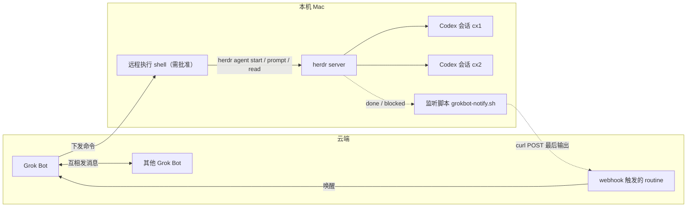

# herdr grokbot

云端 Grok Bot 通过本机 [herdr](https://github.com/herdrdev/herdr) 驱动 Codex。Codex 完成或卡住时，监听脚本把最后输出 POST 给 webhook routine，再唤醒 Grok Bot。灵感 [@turingou](https://x.com/turingou/status/2108386640658038954)。

herdr 是 Rust 写的、面向编程 agent 的终端复用器。文档 <https://herdr.dev/docs>。server 托管 pane，识别 agent 状态 `idle` / `working` / `blocked` / `done` / `unknown`。控制面是 CLI，本地 unix socket `~/.config/herdr/herdr.sock`（每行一个 JSON）。没有 HTTP API，不会主动发 webhook。

动手前先跑 `herdr --skill`，读当前二进制自带的官方 agent 指南。已安装的 `herdr` 是命令语法的权威。官方指南假定调用方在 pane 内（`HERDR_ENV=1`）。本 recipe 是云端 Bot 经用户批准的远程 shell 调本机 CLI，不在 pane 里，因此没有 `HERDR_ENV`。

实测：herdr 0.8.2、codex-cli 0.153、macOS。

## 架构



循环：Grok Bot 发 prompt → Codex 干活 → `done` / `blocked` → 监听脚本 POST → routine 唤醒 Grok Bot → 决定继续、转给别的 Bot，或告诉用户。

## 不要

- 每次远程 shell 都要用户批准。
- pane id 从 JSON 取（`workspace create` 的 `.result.root_pane.pane_id`，例如 `w9:p1`）。不要猜，不要按侧边栏顺序推。
- 批准框先 `agent read` 看命令，确认安全再 `send-keys … y`。
- 批准框之外不要往输入框发字符。输错用 `ctrl+u` 清行。
- 模型不被账号支持时用 `-m` 覆盖，不改用户的 `~/.codex/config.toml`。
- webhook URL 和 Authorization 只放 `~/.config/herdr/grokbot-webhook.env`，不要贴进聊天。
- 本机 `oana grokc` 会话和 Cursor Cloud Agent 走各自的 skill，不用这条回路替代。

## 搭建

1. 安装：

```bash
curl -fsSL https://herdr.dev/install.sh | sh
herdr integration install codex   # 可选
```

2. 常驻 server。直接 `herdr server &` 会随启动它的 shell 退出而死：

```bash
launchctl submit -l dev.herdr.server -o /tmp/herdr-server.log -e /tmp/herdr-server.log -- ~/.local/bin/herdr server
herdr agent list
```

3. 建工作区。pane id 取 `.result.root_pane.pane_id`：

```bash
herdr workspace create --cwd <dir> --label <x> --no-focus
```

4. 启动 Codex。原生参数必须放在 `--` 后面。codex 0.153 没有 `--full-auto`。若 `~/.codex/config.toml` 里的 model 不被 ChatGPT 账号支持（400 model not supported），用 `-m` 覆盖：

```bash
herdr agent start cx1 --kind codex --pane <pane> -- -m gpt-5.5 --sandbox workspace-write --ask-for-approval on-request
```

agent 名须匹配 `[a-z][a-z0-9_-]{0,31}`，且在存活 agent 中唯一。`agent start` 要的是已有的空闲 shell pane，不会自己建 pane。

5. 新目录首次会弹 trust 提示：`start` 返回 `agent_not_ready`（blocked）。名字仍可用于 `read` / `send-keys`。键名用大写 `Enter`，小写 `enter` 无效：

```bash
herdr agent send-keys cx1 Enter
```

6. 发任务。`--wait` 等到第一次落到 `done` 或 `blocked`（也会落到 `idle`）。超时单位毫秒：

```bash
herdr agent prompt cx1 "..." --wait --timeout 600000
herdr agent read cx1 --source recent-unwrapped --lines 60
```

7. 批准框：`prompt` 返回 `blocked` → 先 read 看命令 → 确认安全后：

```bash
herdr agent send-keys cx1 y
```

紧接着的 `herdr agent wait cx1` 会立刻返回旧的 `blocked`（当前状态已经匹配，wait 不会等它变化）。sleep 几秒，再用 `herdr agent get cx1` 轮询 `.result.agent.agent_status`。

## 状态

状态靠读屏幕，可能停在 `unknown`。`unknown` 只说明分不了类，不能当成完成。

- `idle`：可以输入，且该 tab 已在聚焦的 herdr UI 里看过。
- `done`：后台工作结束、UI 还没看过，底层与 `idle` 相同。在 UI 里看过该 tab 之后变成 `idle`。CLI read 不会把它标成已看。
- `blocked`：批准框或提问。
- `working`：正在跑。

CLI 错误是 stderr 上的 JSON，退出码 1。

## 回调

Grok Bot 建一个 webhook 触发的 routine。用户从 routine 面板复制 Webhook URL 和 Authorization header，写到 `~/.config/herdr/grokbot-webhook.env`：

```bash
GROKBOT_WEBHOOK=…
GROKBOT_AUTH=…
```

然后在本机跑（参数是 agent 名，默认 `cx1`）：

```bash
skills/herdr-grokbot/scripts/grokbot-notify.sh cx1
```

脚本轮询 `herdr agent get`。状态变成 `done` 或 `blocked` 且与上次不同时，用 `agent read --source recent-unwrapped --lines 60` 取最后输出，POST JSON `{agent, status, text}`。`GROKBOT_AUTH` 若带 `Authorization: ` 前缀，脚本会去掉再放进 header。空状态（server 还没起来）每 10 秒重试，其余每 5 秒看一次。

herdr 不会主动 webhook，所以这条回路用轮询。下面三项还没在这条回路上验证：

- webhook 实际 POST 能唤醒 routine
- 用插件事件 `pane.agent_status_changed` 代替轮询（socket 文档有这个订阅名；插件钩子未测）
- Codex 自带 notify / Stop hook 作为替代

## 已验证

Grok Bot 远程驱动 Codex 端到端：建工作区 → 启动 → prompt → 批准 `git add` → `done`。Codex 做了零依赖 Node todo CLI，5 个测试通过并 commit。

回调链路未验证。
